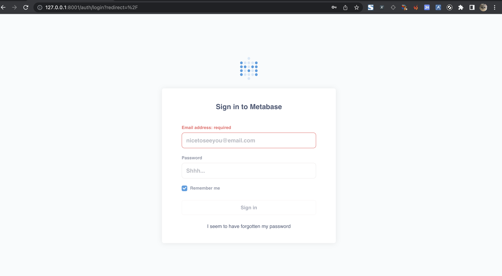

> Clone a website then deploy ...

### install

- go version >=1.18
- add $GOPATH/bin to PATH

```
go install github.com/yangyang5214/clone-alive/cmd/clone-alive@latest 
```

### Examples

```
clone-alive clone https://www.baidu.com/ 
clone-alive alive www.baidu.com 
```

### Usage

```shell
➜  ~ clone-alive 
clone a website, then deploy as a honeypot ...

Usage:
  clone-alive [command]

Examples:
clone-alive clone <url>
clone-alive alive <dir>

Available Commands:
  alive       Deploy as a honeypot
  clone       Clone a website
  completion  Generate the autocompletion script for the specified shell
  help        Help about any command

Flags:
  -h, --help      help for clone-alive
  -v, --version   version for clone-alive

Use "clone-alive [command] --help" for more information about a command.
```

- clone

```shell
➜  ~ clone-alive clone
Usage:
  clone-alive clone [flags]

Flags:
  -c, --concurrent int   the number of concurrent crawling goroutines (default 3)
  -g, --debug            debug ....
  -d, --depth int8       max depth for crawler (default 3)
  -u, --duration int     max duration for crawler. default set 3h (default 10800)
  -a, --headless         use chrome as crawler engine (default true)
  -h, --help             help for clone
  -p, --proxy string     set http proxy
```

- alive

```shell
➜  ~ .clone-alive alive
Usage:
  clone-alive alive [flags]

Flags:
  -b, --debug             debug model for gin
  -h, --help              help for alive
  -d, --home-dir string   static file dir
  -p, --port int          port for server (default 8001)
```

### TODO

- [ ] support depth
- [ ] support parse html for collect more url
- [x] support log response & request log to file
- [x] support http proxy
- [x] support clone result, deploy as honeypot

### Demo

- clone

```shell
➜  ~ clone-alive clone https://www.baidu.com/
       _                          _ _
   ___| | ___  _ __   ___    __ _| (_)_   _____
  / __| |/ _ \| '_ \ / _ \  / _` | | \ \ / / _ \
 | (__| | (_) | | | |  __/ | (_| | | |\ V /  __/
  \___|_|\___/|_| |_|\___|  \__,_|_|_| \_/ \___|, v0.0.5
	
clone-alive

[INF] Start crawler with <chrome>
[INF] 【image/gif】 https://www.baidu.com/img/pcd_e7aeae7e7e413139a48047d2ebcd1ce9.gif find --> /img/pcd_e7aeae7e7e413139a48047d2ebcd1ce9.gif
[INF] {"timestamp":"2023-01-21T17:45:53.91556+08:00","http_method":"GET","url":"https://www.baidu.com/img/pcd_e7aeae7e7e413139a48047d2ebcd1ce9.gif","body_len":658988,"title":"","content_type":"image/gif","body":"","status":200}
[INF] 【image/png】 https://www.baidu.com/img/flexible/logo/pc/result.png find --> /img/flexible/logo/pc/result.png
[INF] {"timestamp":"2023-01-21T17:45:53.966624+08:00","http_method":"GET","url":"https://www.baidu.com/img/flexible/logo/pc/result.png","body_len":8824,"title":"","content_type":"image/png","body":"","status":200}
[INF] 【image/png】 https://www.baidu.com/img/flexible/logo/pc/result@2.png find --> /img/flexible/logo/pc/result@2.png
[INF] {"timestamp":"2023-01-21T17:45:54.027359+08:00","http_method":"GET","url":"https://www.baidu.com/img/flexible/logo/pc/result@2.png","body_len":17072,"title":"","content_type":"image/png","body":"","status":200}
[INF] 【image/png】 https://www.baidu.com/img/flexible/logo/pc/peak-result.png find --> /img/flexible/logo/pc/peak-result.png
[INF] {"timestamp":"2023-01-21T17:45:55.007613+08:00","http_method":"GET","url":"https://www.baidu.com/img/flexible/logo/pc/peak-result.png","body_len":10276,"title":"","content_type":"image/png","body":"","status":200}
[INF] 【text/plain】 https://www.baidu.com/sugrec?prod=pc_his&from=pc_web&json=1&sid=36545_37647_38057_36920_37989_37794_37930_26350_37959_37881&hisdata=&_t=1674294355027&req=2&csor=0 find --> /sugrec
[INF] {"timestamp":"2023-01-21T17:45:55.063479+08:00","http_method":"GET","url":"https://www.baidu.com/sugrec?prod=pc_his\u0026from=pc_web\u0026json=1\u0026sid=36545_37647_38057_36920_37989_37794_37930_26350_37959_37881\u0026hisdata=\u0026_t=1674294355027\u0026req=2\u0026csor=0","body_len":53,"title":"","content_type":"text/plain","body":"","status":200}
[INF] 【image/gif】 https://www.baidu.com/img/pcd_e7aeae7e7e413139a48047d2ebcd1ce9.gif find --> /img/pcd_e7aeae7e7e413139a48047d2ebcd1ce9.gif
[INF] {"timestamp":"2023-01-21T17:45:55.684452+08:00","http_method":"GET","url":"https://www.baidu.com/img/pcd_e7aeae7e7e413139a48047d2ebcd1ce9.gif","body_len":658988,"title":"","content_type":"image/gif","body":"","status":200}
[INF] 【image/png】 https://www.baidu.com/img/flexible/logo/pc/result.png find --> /img/flexible/logo/pc/result.png
[INF] {"timestamp":"2023-01-21T17:45:55.919987+08:00","http_method":"GET","url":"https://www.baidu.com/img/flexible/logo/pc/result.png","body_len":8824,"title":"","content_type":"image/png","body":"","status":200}
[INF] 【image/png】 https://www.baidu.com/img/flexible/logo/pc/result@2.png find --> /img/flexible/logo/pc/result@2.png
[INF] {"timestamp":"2023-01-21T17:45:55.936204+08:00","http_method":"GET","url":"https://www.baidu.com/img/flexible/logo/pc/result@2.png","body_len":17072,"title":"","content_type":"image/png","body":"","status":200}
[INF] 【image/png】 https://www.baidu.com/img/flexible/logo/pc/peak-result.png find --> /img/flexible/logo/pc/peak-result.png
[INF] {"timestamp":"2023-01-21T17:45:55.948904+08:00","http_method":"GET","url":"https://www.baidu.com/img/flexible/logo/pc/peak-result.png","body_len":10276,"title":"","content_type":"image/png","body":"","status":200}
[INF] 【text/html】 https://www.baidu.com/ find --> /
[INF] {"timestamp":"2023-01-21T17:45:56.023983+08:00","http_method":"GET","url":"https://www.baidu.com/","body_len":372128,"title":"","content_type":"text/html","body":"","status":200}
[INF] {"timestamp":"2023-01-21T17:45:56.023983+08:00","http_method":"GET","url":"https://www.baidu.com","body_len":372128,"title":"","content_type":"text/html","body":"","status":200}
[INF] 【text/plain】 https://www.baidu.com/sugrec?prod=pc_his&from=pc_web&json=1&sid=36558_37647_38058_36920_37989_37794_36803_37928_26350_22159_37881&hisdata=&_t=1674294356014&req=2&csor=0 find --> /sugrec
[INF] {"timestamp":"2023-01-21T17:45:56.092764+08:00","http_method":"GET","url":"https://www.baidu.com/sugrec?prod=pc_his\u0026from=pc_web\u0026json=1\u0026sid=36558_37647_38058_36920_37989_37794_36803_37928_26350_22159_37881\u0026hisdata=\u0026_t=1674294356014\u0026req=2\u0026csor=0","body_len":53,"title":"","content_type":"text/plain","body":"","status":200}
[INF] {"timestamp":"2023-01-21T17:45:56.023983+08:00","http_method":"GET","url":"https://www.baidu.com","body_len":372128,"title":"","content_type":"text/html","body":"","status":200}
[INF] Url pending queue is empty, break
```

- alive

```shell
➜  ~ clone-alive alive www.baidu.com -b
[GIN-debug] [WARNING] Creating an Engine instance with the Logger and Recovery middleware already attached.

[GIN-debug] [WARNING] Running in "debug" mode. Switch to "release" mode in production.
 - using env:	export GIN_MODE=release
 - using code:	gin.SetMode(gin.ReleaseMode)

[GIN-debug] GET    /img/pcd_e7aeae7e7e413139a48047d2ebcd1ce9.gif --> github.com/yangyang5214/clone-alive/pkg/alive.(*Alive).handleRoute.func1 (3 handlers)
[GIN-debug] GET    /img/flexible/logo/pc/result.png --> github.com/yangyang5214/clone-alive/pkg/alive.(*Alive).handleRoute.func1 (3 handlers)
[GIN-debug] GET    /img/flexible/logo/pc/result@2.png --> github.com/yangyang5214/clone-alive/pkg/alive.(*Alive).handleRoute.func1 (3 handlers)
[GIN-debug] GET    /img/flexible/logo/pc/peak-result.png --> github.com/yangyang5214/clone-alive/pkg/alive.(*Alive).handleRoute.func1 (3 handlers)
[GIN-debug] GET    /sugrec                   --> github.com/yangyang5214/clone-alive/pkg/alive.(*Alive).handleRoute.func1 (3 handlers)
[GIN-debug] GET    /                         --> github.com/yangyang5214/clone-alive/pkg/alive.(*Alive).handleRoute.func1 (3 handlers)
[GIN-debug] [WARNING] You trusted all proxies, this is NOT safe. We recommend you to set a value.
Please check https://pkg.go.dev/github.com/gin-gonic/gin#readme-don-t-trust-all-proxies for details.
[GIN-debug] Listening and serving HTTP on :8001
```

go to http://localhost:8000/




### Reference

https://github.com/go-rod/rod

https://github.com/imthaghost/goclone

https://github.com/projectdiscovery/katana