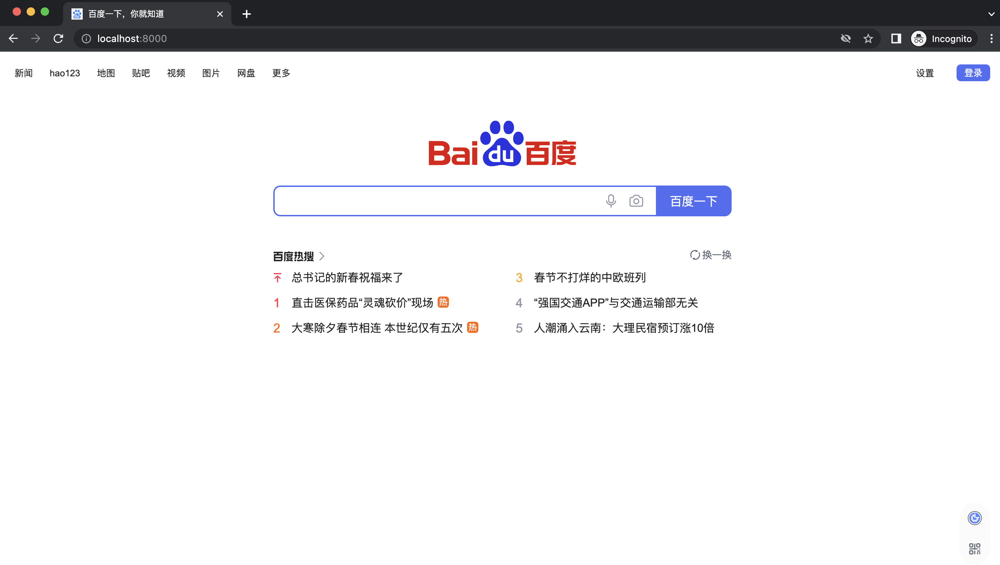

> Clone a website then deploy ...

### install

- go version >=1.18
- add $GOPATH/bin to PATH

```
go install github.com/yangyang5214/clone-alive/cmd/clone-alive@latest 
```

### Examples

```
clone-alive https://www.baidu.com/ 
```

### Usage

```
Usage:
  clone-alive <url> [flags]

Flags:
  -c, --concurrent int   the number of concurrent crawling goroutines (default 3)
  -g, --debug            debug ....
  -d, --depth int8       max depth for crawler (default 3)
  -u, --duration int     max duration for crawler. default set 3h (default 10800)
  -a, --headless         use chrome as crawler engine
  -h, --help             help for clone-alive
```

### Demo

- clone

```
➜  clone-alive git:(master) ✗ ./clone-alive https://www.baidu.com/   
       _                          _ _
   ___| | ___  _ __   ___    __ _| (_)_   _____
  / __| |/ _ \| '_ \ / _ \  / _` | | \ \ / / _ \
 | (__| | (_) | | | |  __/ | (_| | | |\ V /  __/
  \___|_|\___/|_| |_|\___|  \__,_|_|_| \_/ \___|, v0.0.1
	
clone-alive

[INF] Start crawler with <chrome>
[INF] 【image/png】 https://www.baidu.com/img/PCtm_d9c8750bed0b3c7d089fa7d55720d6cf.png find --> /img/PCtm_d9c8750bed0b3c7d089fa7d55720d6cf.png
[INF] 【image/png】 https://www.baidu.com/img/PCfb_5bf082d29588c07f842ccde3f97243ea.png find --> /img/PCfb_5bf082d29588c07f842ccde3f97243ea.png
[INF] 【image/png】 https://www.baidu.com/img/flexible/logo/pc/result.png find --> /img/flexible/logo/pc/result.png
[INF] 【image/png】 https://www.baidu.com/img/flexible/logo/pc/result@2.png find --> /img/flexible/logo/pc/result@2.png
[INF] 【image/png】 https://www.baidu.com/img/flexible/logo/pc/peak-result.png find --> /img/flexible/logo/pc/peak-result.png
[INF] 【text/plain】 https://www.baidu.com/sugrec?prod=pc_his&from=pc_web&json=1&sid=36544_37647_36920_37793_37938_37874_26350_38009_37881&hisdata=&_t=1674096599420&req=2&csor=0 find --> /sugrec
[INF] 【image/png】 https://www.baidu.com/img/PCtm_d9c8750bed0b3c7d089fa7d55720d6cf.png find --> /img/PCtm_d9c8750bed0b3c7d089fa7d55720d6cf.png
[INF] 【image/png】 https://www.baidu.com/img/PCfb_5bf082d29588c07f842ccde3f97243ea.png find --> /img/PCfb_5bf082d29588c07f842ccde3f97243ea.png
[INF] 【image/png】 https://www.baidu.com/img/flexible/logo/pc/result.png find --> /img/flexible/logo/pc/result.png
[INF] 【image/png】 https://www.baidu.com/img/flexible/logo/pc/result@2.png find --> /img/flexible/logo/pc/result@2.png
[INF] 【image/png】 https://www.baidu.com/img/flexible/logo/pc/peak-result.png find --> /img/flexible/logo/pc/peak-result.png
[INF] 【text/html】 https://www.baidu.com/ find --> /
[INF] 【text/plain】 https://www.baidu.com/sugrec?prod=pc_his&from=pc_web&json=1&sid=36553_37647_36920_37990_37802_37922_26350_37881&hisdata=&_t=1674096599631&req=2&csor=0 find --> /sugrec
[INF] {"timestamp":"2023-01-19T10:50:03.000251+08:00","url":"https://www.baidu.com/","body_len":70745,"title":"百度一下，你就知道"}
[INF] Url pending queue is empty, break
```

- alive

```
➜  clone-alive git:(master) ✗ cd www.baidu.com 
➜  www.baidu.com git:(master) ✗ python3 -m http.server                           
Serving HTTP on :: port 8000 (http://[::]:8000/) ...

```

go to http://localhost:8000/



- more demo


### Reference

https://github.com/go-rod/rod

https://github.com/imthaghost/goclone

https://github.com/projectdiscovery/katana